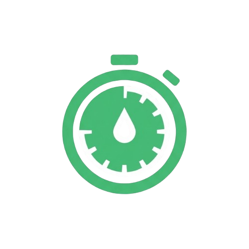

# 🍅 EM Me Focus - Premium Productivity Suite & Mobile App

  

**EM Me Focus** is a state-of-the-art, high-end single-page productivity suite and a fully packaged native Android Mobile Application. Designed with futuristic space-grade Glassmorphism aesthetics, it features real-time spatial binaural audio synthesizers, customizable focus targets, micro-animations, and complete offline capability.

**EM Me Focus** යනු අනාගතවාදී (futuristic) Glassmorphism මෝස්තරයකින් නිමවා ඇති, උසස් මට්ටමේ single-page productivity web application එකක් සහ ජංගම දුරකථන සඳහාම නිපදවන ලද native Android App (APK) එකකි. 

---

## 🌟 Key Features / ප්‍රධාන විශේෂාංග

### 1. Space-Grade UI/UX & Multi-Themes
- **5 Dynamic Gradient Themes**: Instantly change color tokens, moving glow blobs, and progress fills:
  - 🌌 **Cosmic Aurora** (Default - purple/cyan aura)
  - 🌅 **Sunset Dream** (Warm peach-coral-pink sunset gradient)
  - ⚡ **Cyberpunk Grid** (Vibrant neon magenta/cyan cyber vibes)
  - 🌲 **Midnight Forest** (Relaxing emerald-teal nature gradient)
  - 🌊 **Ocean Deep** (Refreshing aquamarine/indigo ocean breeze)
- **Glowing Orbit Particle**: A rotating glowing orb particle that orbits at the exact tip of the circular progress ring in real-time.
- **Heartbeat countdown**: Subtle pulsing effects on the timer text when focusing is active.

### 2. Binaural Synthesized Audio Mixer (Web Audio API)
Generates high-quality, scientifically calibrated background frequencies directly in your browser or mobile phone without requiring heavy audio files:
- 🌧️ **Binaural Rain**: Wet, organic filtered noise with dynamic amplitude drift.
- 🌊 **Ocean Waves**: Modulated pink noise using a slow LFO for realistic tide swellings.
- 🌲 **Forest Wind**: Dynamic bandpass-filtered noise swept gently over forest wind frequencies.
- 🔇 **Pure Focus Pink Noise**: Voss-McCartney filtered frequencies for pure concentration.
- **Dynamic Mixer**: Independent volume sliders and toggles to mix your perfect focus sound.

### 3. Integrated Focus Suite
- **Session Preset Chips**: Immediate intervals: `🧠 Focus (25m)`, `☕ Short Break (5m)`, `🌴 Long Break (15m)` with active glowing states.
- **Accordion Custom Timer**: An expandable panel for custom hours/minutes durations, keeping the main screen minimalist.
- **Completion Confetti**: A high-performance canvas-based physics confetti celebration triggered upon study target completion.
- **Interactive Daily Target**: Dynamic metrics tracking (`0 / 4 focus sessions`) with automatic visual fills and motivational praise.
- **Interactive Focus Tasks (To-Do)**: Add, check, and delete focus items with slide-in entries and strike-through animations.

---

## 📱 Mobile App installation / ඇන්ඩ්‍රොයිඩ් ඇප් එක ස්ථාපනය

This project is compiled as a native Android app using a modern Jetpack Compose WebView shell featuring hardware acceleration and zero-pinch touch responsive layouts.

මෙම ඇප් එක, ජංගම දුරකථනයට ගැලපෙන Launcher Icon එකක් සහ optimized fullscreen viewport එකක් සහිතව සාර්ථකව Android APK එකක් ලෙස compile කර ඇත.

### 📥 How to Install / ස්ථාපනය කරගන්නා ආකාරය:
1. Copy the installable file **[EM-Me-Focus-v2.apk](EM-Me-Focus-v2.apk)** from your workspace root folder directly to your Android Mobile Phone.
2. Open the file on your phone and tap **Install** (If asked, allow installation from "Unknown Sources" or your File Manager).
3. Open the **EM Me Focus** app from your launcher and start focusing with the brand-new icon!

1. ඔබගේ workspace root folder එකෙහි ඇති **[EM-Me-Focus-v2.apk](EM-Me-Focus-v2.apk)** ගොනුව ඔබගේ Android ජංගම දුරකථනයට copy කරගන්න.
2. ජංගම දුරකථනයෙන් එම file එක open කර **Install** කරන්න (පළමු වරට සිදු කරන්නේ නම් "Unknown Sources" සක්‍රීය කරන්න).
3. ඔබගේ App Drawer එකෙහි ඇති **EM Me Focus** අයිකනය ක්ලික් කර ඇප් එක විවෘත කරන්න!

---

## 💻 Web/Desktop Usage / පරිගණක භාවිතය

### Direct Launch:
- Simply double-click the **[index.html](index.html)** file inside your main folder to open the upgraded focus timer instantly in any modern web browser.
- **Offline first**: Works 100% offline without needing any internet connection or servers!

- ප්‍රධාන ෆෝල්ඩරයේ ඇති **[index.html](index.html)** ගොනුව ඕනෑම browser එකකින් (Chrome, Firefox, Edge) open කර සෘජුවම භාවිතා කරන්න. 
- **100% Offline**: කිසිම අන්තර්ජාල සම්බන්ධතාවයකින් තොරව ක්‍රියාත්මක වේ!

---

## ⌨️ Keyboard Shortcuts / කෙටිමං

Optimize your workspace without touching your mouse:
- **`Spacebar`** - Start or Pause the focus timer.
- **`R Key`** - Reset the timer (when paused).
- **`F Key`** - Open/Exit the distraction-free Fullscreen Focus View.
- **`1 / 2 / 3`** - Toggle Presets: Focus (25m), Short Break (5m), and Long Break (15m).

---

## 🛠️ Tech Stack & Architecture

- **Web Frontend**: HTML5 semantic layers, Vanilla CSS3 Custom Variables, JavaScript ES6.
- **Audio Synthesizer**: Web Audio API oscillator nodes, gain nodes, and dynamic BiquadFilters.
- **Animations**: Canvas 2D render loop, CSS keyframes, and cubic-bezier transitions.
- **Android Shell**: Kotlin, Android SDK 34 (Target 36), Jetpack Compose WebView interops with hardware layers.

---

**Crafted with focus, beauty, and scientific precision 🍅**
